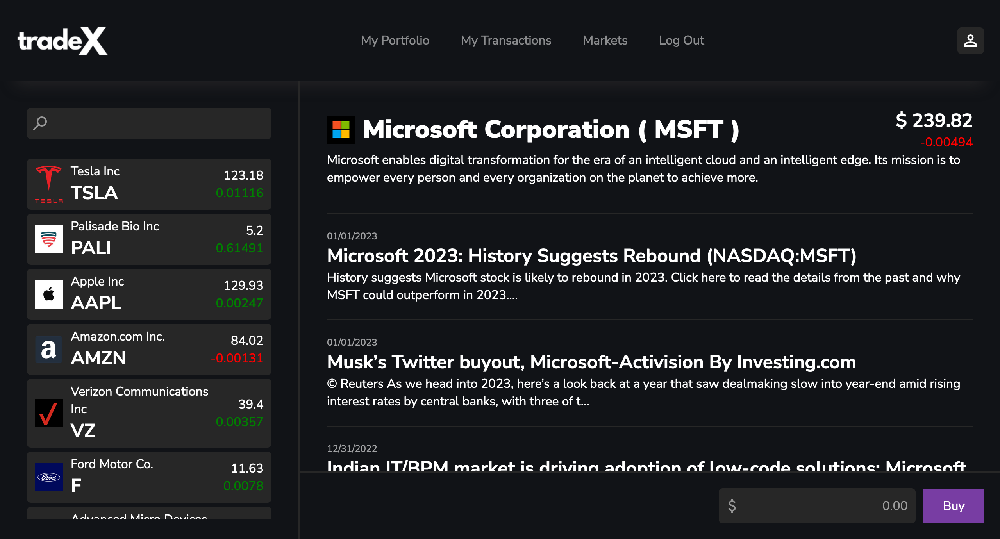

# Stock Trading App

A Ruby on Rails application that allows users to buy and sell stocks using IEX Cloud API.

## Tech Stack

- Ruby on Rails
- PostgreSQL
- SASS

## User Login

### Admin

email: `john@email.com`  
password: `password`

### Trader

email: `steve@email.com`  
password: `password`

## Live Demo

Render (https://stock-trading-app-ykds.onrender.com)

## Source

IEX Ruby Client (https://github.com/dblock/iex-ruby-client)
